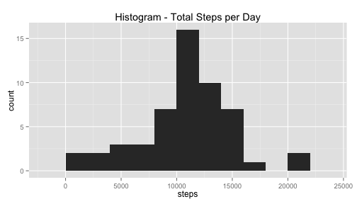
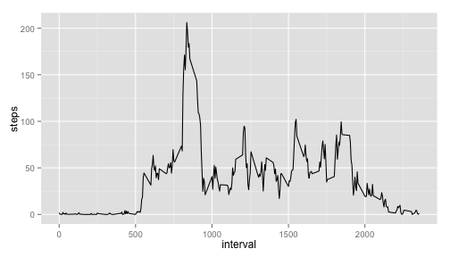
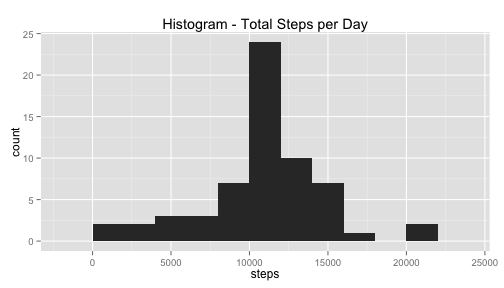

## Loading and preprocessing the data

```r
unzip("activity.zip")
a<-read.csv("activity.csv")
```
Process/transform data:

```r
# convert Date column from factor to date data type
a$date<-as.Date(as.character(a$date), format = "%Y-%m-%d")
```

## What is mean total number of steps taken per day?


```r
# steps per day
countPerDay<-aggregate(steps~date, data=a, FUN=sum)
library("ggplot2")
```
Histogram of the steps taken each day:

```r
# histogram
qplot(steps,data=countPerDay,main="Histogram - Total Steps per Day",binwidth=2000)
```

 

Calculate mean and median total number of steps taken per day:

```r
# mean and median number of steps taken
meanSteps<-mean(countPerDay$steps)
# median
medianSteps<-median(countPerDay$steps)
```
Mean is 1.0766189 &times; 10<sup>4</sup> and median is 10765.

## What is the average daily activity pattern?

```r
stepsPer5<-aggregate(steps~interval, data=a, FUN=mean)
```

```r
qplot(interval,steps,data=stepsPer5,geom=c("line"))
```

 

Calculate the 5-minute interval, on average across all the days in the dataset, contains the maximum number of steps:

```r
# maximum steps
maxsteps<-max(stepsPer5$steps)
maxStepInt<-stepsPer5[stepsPer5$steps == maxsteps,]
# interval wih the max steps is:
max5int<-maxStepInt$interval
```
Interval 835 contains the maximum number of steps on average.

## Imputing missing values

Calculate the total number of missing values in the dataset:

```r
# list rows of data that have missing values 
numMissDays<-sum(is.na(a$steps))
```
2304 days have missing values.

Replace missing values for the mean of that 5-minute interval.


```r
filledata<-a
for (rows in 1:nrow(filledata)){
    if (is.na(filledata[rows,1])){
        #interval of the missing value
        interv<-filledata[rows,3]
        # steps corresponding to that interval from avg table
        stepInterv<-stepsPer5[stepsPer5$interval == interv,2]
        filledata[rows,1]<-stepInterv
    }
}
```

Calculate the number of stes taken each day in the filled data:

```r
# steps per day
countPerDayf<-aggregate(steps~date, data=filledata, FUN=sum)
```
Histogram of the steps taken each day:

```r
# histogram
qplot(steps,data=countPerDayf,main="Histogram - Total Steps per Day",binwidth=2000)
```

 
Calculate mean and median total number of steps taken per day:

```r
# mean and median number of steps taken
meanStepsf<-mean(countPerDayf$steps)
# median
medianStepsf<-median(countPerDayf$steps)
```
Mean is 1.0766189 &times; 10<sup>4</sup> and median is 1.0766189 &times; 10<sup>4</sup>.

## Are there differences in activity patterns between weekdays and weekends?

Create a new factor variable to differentiate weekday vs weekend:

```r
filledata$Day<-weekdays(filledata$date)
for (row in 1:nrow(filledata)){
    if (filledata[row,4] == "Saturday"| filledata[row,4] == "Sunday"){
        filledata[row,4]<-"Weekend"
    }
    else{filledata[row,4]<-"Weekday"}
}
filledata$Day<-as.factor(filledata$Day)
```

Plot average activity during the day for weekday vs weekend:

```r
intervalsteps<-aggregate(steps~interval+Day, data=filledata, FUN=mean)
qplot(interval,steps,data=intervalsteps,geom=c("line"),facets=Day~.)
```

 
